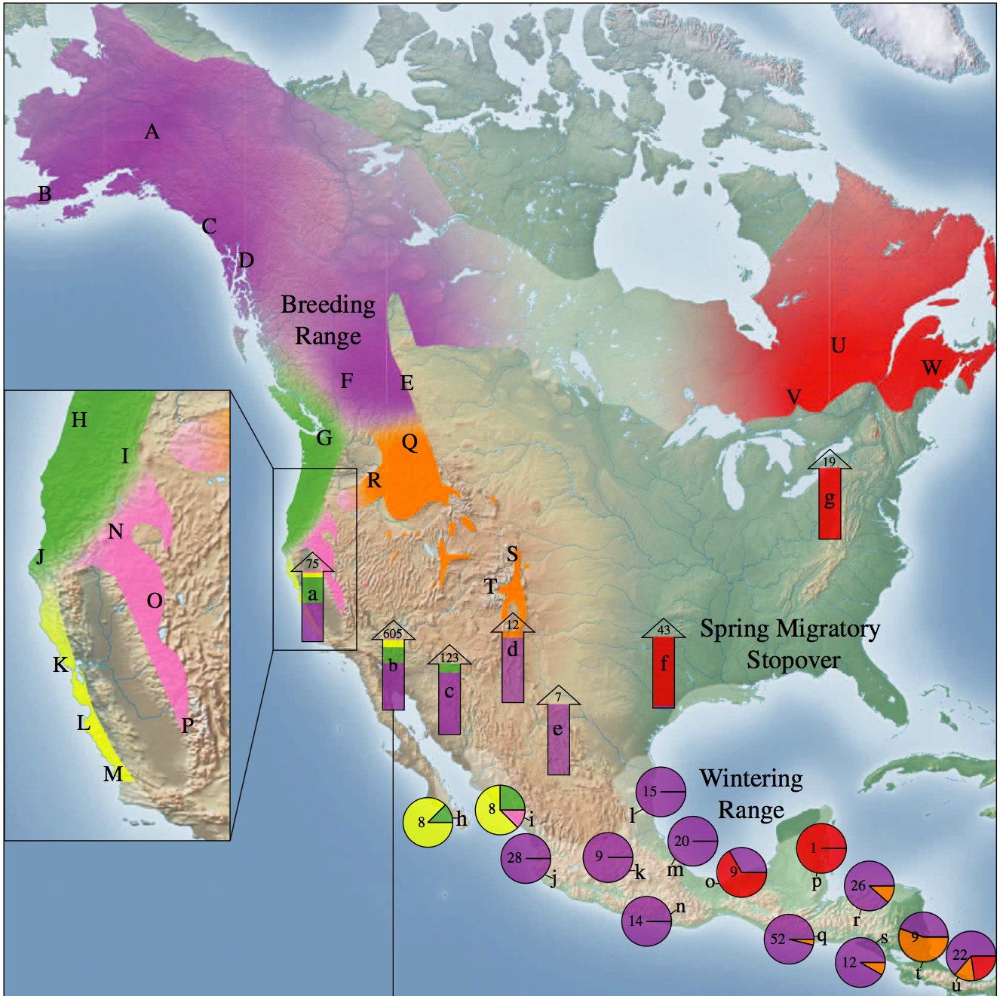

make-a-BGP-map
================
Eric C. Anderson

Hello\! This is the GitHub site for an Rstudio project that contains
example data and a notebook about how static maps are made for the [Bird
Genoscape Project](https://www.birdgenoscape.org/). We’re talking here
about the static maps with the genoscapes smeared across them, not the
interactive maps that you will find on the BGP website (those are made
using a different set of packages in R).

Below is an example of the kind of map we are talking about. Note that
we are not going to make that map exactly, because that was done in 2012
or so with very different tools (I think I even made it using base R
functions rather than ggplot). And some of the elements in this figure
are hand-placed.

The landscape has changed considerably, even in the last few years, so
this is an update to BGP map-making using packages ‘sf’, ‘ggplot2’,
‘ggspatial’, and a handful of others

To follow along with this process, clone this repository and follow the
steps and explanation in `001-make-a-BGP-map.Rmd`. If you want to see
what that notebook looks like in html, you can visit it
at

